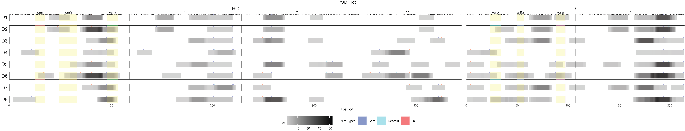

PepMapViz: A Versatile Toolkit for Peptide Mapping, Visualization, and Comparative Exploration ================

## PepMapViz

PepMapViz is a versatile R visualization package that empowers researchers with comprehensive visualization tools for seamlessly mapping peptides to protein sequences, identifying distinct domains and regions of interest, accentuating mutations, and highlighting post-translational modifications, all while enabling comparisons across diverse experimental conditions. Potential applications of PepMapViz include the visualization of cross-software mass spectrometry results at the peptide level for specific protein and domain details in a linearized format and post-translational modification coverage across different experimental conditions; unraveling insights into disease mechanisms. It also enables visualization of MHC-presented peptide clusters in different antibody regions predicting immunogenicity in antibody drug development.

## Installation

You can install the development version of PepMapViz from GitHub using the `devtools` package.

``` r
# Install devtools if you haven't already
install.packages("devtools")

# Install PepMapViz from the package
devtools::build()
devtools::install()
```

## Features

1.  Mapping peptides to protein sequences
2.  Identifying distinct domains and regions of interest
3.  Accentuating mutations
4.  Highlighting post-translational modifications
5.  Enabling comparisons across diverse experimental conditions

## Usage

This is a basic example which shows you how to solve a common problem:

``` r
library(PepMapViz)

# Read all files from a folder
folder_path <- system.file("extdata/example_PEAKS_result", package = "PepMapViz")
resulting_df <- combine_files_from_folder(folder_path)
meta_data_path <- system.file("extdata/example_PEAKS_metadata", package = "PepMapViz")
meta_data_df <- combine_files_from_folder(meta_data_path)
resulting_df <- merge(
  x = resulting_df,
  y = meta_data_df,
  by = "Source File",
  all.x = TRUE  # Left join behavior
)

# Strip the sequence 
striped_data_peaks <- strip_sequence(resulting_df, "Peptide", "Sequence", "PEAKS")

# Extract modifications information
PTM_table <- data.frame(PTM_mass = c("15.99", ".98", "57.02"),
                        PTM_type = c("Ox", "Deamid", "Cam"))
converted_data_peaks <- obtain_mod(
  striped_data_peaks,
  "Peptide",
  "PEAKS",
  seq_column = NULL,
  PTM_table,
  PTM_annotation = TRUE,
  PTM_mass_column = "PTM_mass"
)

# Match peptide sequence with provided sequence and calculate positions
whole_seq <- data.frame(
  Epitope = c("Boco", "Boco"),
  Chain = c("HC", "LC"),
  Region_Sequence = c("QVQLVQSGAEVKKPGASVKVSCKASGYTFTSYYMHWVRQAPGQGLEWMGEISPFGGRTNYNEKFKSRVTMTRDTSTSTVYMELSSLRSEDTAVYYCARERPLYASDLWGQGTTVTVSSASTKGPSVFPLAPCSRSTSESTAALGCLVKDYFPEPVTVSWNSGALTSGVHTFPAVLQSSGLYSLSSVVTVPSSNFGTQTYTCNVDHKPSNTKVDKTVERKCCVECPPCPAPPVAGPSVFLFPPKPKDTLMISRTPEVTCVVVDVSHEDPEVQFNWYVDGVEVHNAKTKPREEQFNSTFRVVSVLTVVHQDWLNGKEYKCKVSNKGLPSSIEKTISKTKGQPREPQVYTLPPSREEMTKNQVSLTCLVKGFYPSDIAVEWESNGQPENNYKTTPPMLDSDGSFFLYSKLTVDKSRWQQGNVFSCSVMHEALHNHYTQKSLSLSPGK", 
                      "DIQMTQSPSSLSASVGDRVTITCRASQGISSALAWYQQKPGKAPKLLIYSASYRYTGVPSRFSGSGSGTDFTFTISSLQPEDIATYYCQQRYSLWRTFGQGTKLEIKRTVAAPSVFIFPPSDEQLKSGTASVVCLLNNFYPREAKVQWKVDNALQSGNSQESVTEQDSKDSTYSLSSTLTLSKADYEKHKVYACEVTHQGLSSPVTKSFNRGEC"
  )
)
matching_result <- match_and_calculate_positions(
  converted_data_peaks,
  'Sequence',
  whole_seq,
  match_columns = NULL,
  sequence_length = c(10, 30),
  column_keep = c(
    "PTM_mass",
    "PTM_position",
    "reps",
    "Area",
    "Donor",
    "PTM_type"
  )
)

# Quantify matched peptide sequences by PSM
matching_columns = c("Chain", "Epitope")
distinct_columns = c("Donor")
data_with_psm <- peptide_quantification(
  whole_seq,
  matching_result,
  matching_columns,
  distinct_columns,
  quantify_method = "PSM",
  with_PTM = TRUE,
  reps = TRUE
)
region <- data.frame(
  Epitope = c("Boco", "Boco", "Boco", "Boco", "Boco", "Boco"),
  Chain = c("HC", "HC", "HC", "HC", "LC", "LC"),
  Region = c("VH", "CH1", "CH2", "CH3", "VL", "CL"),
  Region_start = c(1,119,229,338,1,108),
  Region_end = c(118,228,337,444,107,214)
)
result_with_psm <- data.frame()
for (i in 1:nrow(region)) {
  chain <- region$Chain[i]
  region_start <- region$Region_start[i]
  region_end <- region$Region_end[i]
  region_name <- region$Region[i]

  temp <- data_with_psm[data_with_psm$Chain == chain & 
                          data_with_psm$Position >= region_start & 
                          data_with_psm$Position <= region_end, ]
  temp$Region <- region_name

  result_with_psm <- rbind(result_with_psm, temp)
}
  
head(result_with_psm)
```

```         
##   Character Position Chain Epitope PSM Donor   PTM PTM_type Region
## 1         Q        1    HC    Boco   0    D1 FALSE     <NA>     VH
## 2         V        2    HC    Boco   0    D1 FALSE     <NA>     VH
## 3         Q        3    HC    Boco   0    D1 FALSE     <NA>     VH
## 4         L        4    HC    Boco   0    D1 FALSE     <NA>     VH
## 5         V        5    HC    Boco   0    D1 FALSE     <NA>     VH
## 6         Q        6    HC    Boco   0    D1 FALSE     <NA>     VH
```

``` r
# Plotting peptide in whole provided sequence
domain <- data.frame(
  domain_type = c("VH", "CH1", "CH2", "CH3", "VL", "CL", "CDR H1", "CDR H2", "CDR H3", "CDR L1", "CDR L2", "CDR L3"),
  Chain = c("HC", "HC", "HC", "HC",  "LC", "LC", "HC", "HC", "HC",  "LC", "LC", "LC"),
  Epitope = c("Boco", "Boco", "Boco", "Boco", "Boco", "Boco", "Boco", "Boco", "Boco", "Boco", "Boco", "Boco"),
  domain_start = c(1, 119, 229, 338, 1, 108, 26, 50, 97, 24, 50, 89),
  domain_end = c(118, 228, 337, 444, 107, 214, 35, 66, 107,  34, 56, 97),
  domain_color = c("black", "black", "black", "black", "black", "black", "#F8766D", "#B79F00", "#00BA38", "#00BFC4", "#619CFF", "#F564E3"),
  domain_fill_color = c("white", "white", "white", "white", "white", "white", "yellow", "yellow", "yellow", "yellow", "yellow", "yellow"), 
  domain_label_y = c(1.7, 1.7, 1.7, 1.7, 1.7, 1.7, 1.4, 1.4, 1.4, 1.4, 1.4, 1.4)
)
x_axis_vars <- c("Region")
y_axis_vars <- c("Donor")
column_order <- list(
    Donor = "D1,D2,D3,D4,D5,D6,D7,D8",
    Region = "VH,CH1,CH2,CH3,VL,CL"
)
PTM_color <- c(
  "Ox" = "red",
  "Deamid" = "cyan",
  "Cam" = "blue",
  "Acetyl" = "magenta"
)
label_filter = list(Donor = "D1")
```

```{r psm-plot, fig.width=30, fig.height=6, echo=TRUE, message=FALSE, warning=FALSE}
library(PepMapViz)
p_psm <- create_peptide_plot(
  data_with_psm,
  y_axis_vars,
  x_axis_vars,
  y_expand = c(0.2, 0.2),
  x_expand = c(0.5, 0.5),
  theme_options = list(legend.box = "horizontal", legend.position = "bottom"),
  labs_options = list(title = "PSM Plot", x = "Position", fill = "PSM"),
  color_fill_column = 'PSM',
  fill_gradient_options = list(),  # Set the limits for the color scale
  label_size = 1.3,
  add_domain = TRUE,
  domain = domain,
  domain_start_column = "domain_start",
  domain_end_column = "domain_end",
  domain_type_column = "domain_type",
  domain_border_color_column = "domain_color",
  domain_fill_color_column = "domain_fill_color",
  add_domain_label = TRUE,
  domain_label_size = 2,
  domain_label_y_column = "domain_label_y",
  domain_label_color = "black",
  PTM = TRUE,
  PTM_type_column = "PTM_type",
  PTM_color = PTM_color,
  add_label = TRUE,
  label_column = "Character",
  label_filter = label_filter,
  label_y = 1,
  column_order = column_order
)
print(p_psm)
```



## Getting Started

### Launching the Shiny App

You can interactively explore your data and visualization options using the built-in Shiny application provided by PepMapViz. Simply run the following command in your R console to launch the app:

``` r
PepMapViz::run_pepmap_app()
```

This will open a user-friendly graphical interface for peptide mapping, visualization, and comparative exploration.

For a detailed guide on how to use PepMapViz, please refer to our vignette and docuemntation under inst/doc.

## License

This project is licensed under the MIT License

Copyright (c) 2024, Genentech, Inc.

Permission is hereby granted, free of charge, to any person obtaining a copy of this software and associated documentation files (the "Software"), to deal in the Software without restriction, including without limitation the rights to use, copy, modify, merge, publish, distribute, sublicense, and/or sell copies of the Software, and to permit persons to whom the Software is furnished to do so, subject to the following conditions:

The above copyright notice and this permission notice shall be included in all copies or substantial portions of the Software.

THE SOFTWARE IS PROVIDED "AS IS", WITHOUT WARRANTY OF ANY KIND, EXPRESS OR IMPLIED, INCLUDING BUT NOT LIMITED TO THE WARRANTIES OF MERCHANTABILITY, FITNESS FOR A PARTICULAR PURPOSE AND NONINFRINGEMENT. IN NO EVENT SHALL THE AUTHORS OR COPYRIGHT HOLDERS BE LIABLE FOR ANY CLAIM, DAMAGES OR OTHER LIABILITY, WHETHER IN AN ACTION OF CONTRACT, TORT OR OTHERWISE, ARISING FROM, OUT OF OR IN CONNECTION WITH THE SOFTWARE OR THE USE OR OTHER DEALINGS IN THE SOFTWARE.

## Acknowledgments
